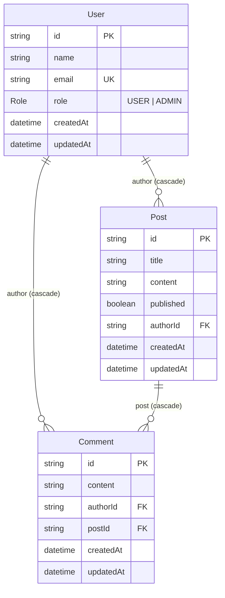

# Backend Architecture Review

**Stack:** Next.js 16 (App Router) · TypeScript · Prisma ORM (driver adapter) · PostgreSQL (Supabase)

How data flows from an HTTP request down to Postgres in this project today — where the pattern is clean, where two competing implementations have grown side by side, and what to do about it.

---

## 1. Request flow

The documented pattern (`docs/prisma-next-architecture.md`) is a thin MVC: routes only wire a URL to a controller, controllers parse/validate/shape, services own every Prisma call. That pattern is real and mostly followed for **users**, **posts**, and **comments** — but a second, older path still lives at `/api/learning` and skips it entirely.

```mermaid
flowchart TB
    client(["Client request"])

    subgraph mainpath["Primary path — users · posts · comments"]
        direction TB
        route["app/api/*/route.ts\nthin wiring only"]
        controller["lib/controllers/*Controller.ts\nparse + validate + shape response"]
        service["lib/services/*Service.ts\nbusiness rules + Prisma queries"]
        route --> controller --> service
    end

    subgraph sidepath["Parallel path — /api/learning (superseded)"]
        direction TB
        route2["app/api/learning/**/route.ts"]
        inline["prisma.user.* called directly in the route\nuses userResource + userValidator inline"]
        route2 --> inline
    end

    subgraph serveraction["Dashboard forms"]
        direction TB
        action["lib/actions/*Actions.ts\n(\"use server\")"]
        action --> service
    end

    client --> route
    client --> route2
    client --> action

    prisma["lib/db/prisma.ts\nPrismaClient singleton, pg.Pool adapter"]
    pg[("PostgreSQL")]

    service --> prisma
    inline --> prisma
    prisma --> pg
```

The dashed relationship above (rendered as the `sidepath` subgraph) is the `/api/learning` routes, which predate the controller/service split and still bypass it — see Finding 1 below.

### Connection layer

`lib/db/prisma.ts` is solid: it uses the modern driver-adapter pattern (`@prisma/adapter-pg` over a `pg.Pool`), and caches both the pool and the client on `globalThis` so Next.js dev-mode hot reload doesn't leak a new connection pool on every file save. This is the correct way to run Prisma against Postgres in a serverless/edge-adjacent Next.js app.

---

## 2. Data model

One model per file under `prisma/schema/` (Prisma's `prismaSchemaFolder` preview feature), merged at build time — enums centralized, no imports needed between files.



All foreign keys are `onDelete: Cascade` — deleting a user removes their posts and comments; deleting a post removes its comments. IDs are `cuid()`.

---

## 3. Folder map

```
prisma/
├── schema/          # user.prisma, post.prisma, comment.prisma, enums.prisma
├── seed/            # userSeeder → postSeeder → commentSeeder, run in order
└── migrations/      # 3 migrations so far, plain SQL

lib/
├── db/prisma.ts            # PrismaClient singleton (pg adapter)
├── models/                 # PublicUser, PostWithAuthor, *Filter — types only
├── services/                # the only place Prisma is queried (primary path)
├── controllers/             # parse request → call service → shape response
├── actions/                 # "use server" — dashboard forms call services directly
├── resources/                # userResource/postResource — built, not wired in
├── validators/                # userValidator + 422 helper — built, not wired in
└── logger.ts                # leveled console logger, used by controllers + actions

app/
├── api/users, posts, comments/     # thin — forward to controllers
├── api/learning/                   # old experiment, calls Prisma inline
├── generated/prisma/               # Prisma client output (checked into app/)
└── dashboard/                      # server-rendered pages, post to *Actions

public/                              # default Next.js SVGs only, unused by the API
```

### Layer responsibilities

| Layer | Files | Owns |
|---|---|---|
| Model | `lib/models/*.ts` | Public TS shapes + filter types. No logic. |
| Service | `lib/services/*.ts` | Every Prisma call, explicit `select`, pagination, business rules. |
| Controller | `lib/controllers/*.ts` | Parse request, validate input, map Prisma errors → HTTP status, respond. |
| Route | `app/api/**/route.ts` | Wire URL + method to a controller export. Nothing else. |
| Action | `lib/actions/*.ts` | Server actions for dashboard `<form>`s — call services directly (no HTTP hop), then `redirect()`. |

---

## 4. Findings

Nothing here is broken in the sense of "throws in production" — the app runs. These are structural drifts that will cost time later: dead abstractions, duplicated logic, and two answers to "how do I add a new resource?"

### 🔴 Two competing implementations of the User API
`/api/users` follows the documented controller→service pattern. `/api/learning` queries Prisma directly inside the route file and calls `userResource`/`validateCreateUser` inline. Same entity, two different request lifecycles, two different response shapes.
Files: `app/api/learning/route.ts`, `app/api/learning/[id]/route.ts`, `app/api/users/route.ts`

### 🟠 Resources exist but the real controllers don't use them
`userResource`/`postResource` are only imported by the `/api/learning` routes. `userController` and `postController` return whatever the service gives back via `NextResponse.json(result)` directly — no resource shaping at all in the primary path.
Files: `lib/resources/userResource.ts`, `lib/resources/postResource.ts`

### 🟠 Validators exist but the real controller reimplements validation ad hoc
`validateCreateUser`/`validateUpdateUser` return Laravel-style field arrays with a 422 response. `userController.createUser` ignores them and hand-checks only `name` and `email` — role is never validated on the primary path, and the error shape (`400 { error }`) differs from the validator's (`422 { message, errors[] }`). Post and Comment have no validators at all.
Files: `lib/validators/userValidator.ts`, `lib/controllers/userController.ts`

### 🟠 `postResource` would silently truncate the API if it were ever wired in
`postResource` returns only `id`, `title`, `published` — dropping `content`, `author`, and both timestamps that `postService` actually selects. It was clearly written against an earlier, smaller `Post` shape and never updated alongside the service.
Files: `lib/resources/postResource.ts`

### 🟠 Prisma error-code handling and basic checks are copy-pasted per controller
The same three patterns repeat in every controller and every action: `if (!field) return 400`, `catch { if (error.code === "P2002"/"P2003"/"P2025") ... }`, and a generic 500 fallback. `lib/actions/userActions.ts` re-derives the same name/email checks that `userController` already has, with its own comment admitting it "mirrors" them.
Files: `lib/controllers/*.ts`, `lib/actions/*.ts`

### 🟢 Service layer itself is consistent and correctly scoped
All three services follow the same shape: a named `*_SELECT` constant so no column ever leaks by accident, `count()` + `findMany()` run in parallel via `Promise.all` for list endpoints, and update funcs check existence first to return `null` instead of throwing. No auth/authorization layer exists yet on any path — worth flagging separately since every CRUD endpoint is currently open.
Files: `lib/services/userService.ts`, `lib/services/postService.ts`, `lib/services/commentService.ts`

---

## 5. Recommendations

1. **Decide the fate of `/api/learning`.** If it was a scratch space for practicing the resource/validator pattern, either delete it or rename it clearly (e.g. `app/api/_scratch/`) so it can't be mistaken for a second real API.
   *Why: right now a new contributor has no way to tell which of the two user endpoints is "the real one."*

2. **Wire `userValidator` into `userController`, and add matching validators for Post and Comment.** Delete the inline hand-checks once the shared validator covers the same fields (including `role`).
   *Why: one validation source means the 422 error shape, the field list, and the actions layer can all point at the same function instead of drifting independently.*

3. **Either wire resources into every controller response, or delete `lib/resources/`.** If you keep them, fix `postResource` to match `PostWithAuthor` first — as written it would drop `content` from every response.
   *Why: an unused abstraction next to a used one is the first thing a future refactor trusts by mistake.*

4. **Factor the repeated Prisma-error → HTTP-status mapping into one helper** (e.g. `lib/controllers/handlePrismaError.ts` covering P2002/P2003/P2025), called from every controller's catch block.
   *Why: it's currently duplicated four times with slightly different wording each time; a schema change to error handling means editing all four.*

5. **Add an authorization check before this goes anywhere near real users** — at minimum, gate mutation routes behind a session check.
   *Why: every POST/PATCH/DELETE across users, posts, and comments is currently reachable by anyone who can send an HTTP request.*

---

*Reviewed against the working tree on 2026-07-26 · `docs/prisma-next-architecture.md` is accurate for the primary path only.*
